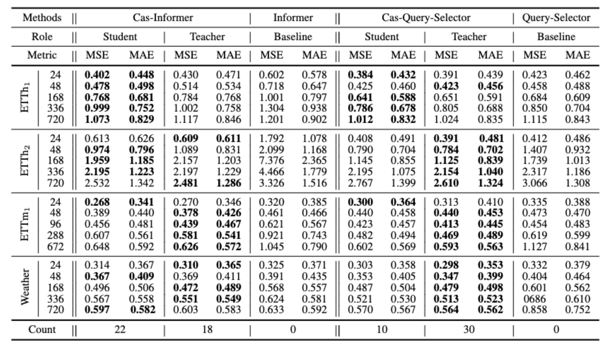

# Learning to Weighted Time-series via Cascaded Teaching Transformers 


This is the origin Pytorch implementation of Cascaded Framework in the following paper: 
Learning to Weighted Time-series via Cascaded Teaching Transformers


<p align="center">

<br><br>
<b>Figure 1.</b> The architecture of cascaded framework.
</p>

## Requirements

- Python 3.8
- matplotlib == 3.1.1
- numpy == 1.19.4
- pandas == 0.25.1
- scikit_learn == 0.21.3
- torch == 1.10.0

Dependencies can be installed using the following command:
```bash
pip install -r requirements.txt
```

## Data

The ETT dataset used in the paper can be download in the repo [ETDataset](https://github.com/zhouhaoyi/ETDataset).
The required data files should be put into `data/ETT/` folder. 


## Usage
Commands for training and testing the model with *Cascaded Framework* on Dataset ETTh1:

```bash
# ETTh1
python -u main.py --fourrier --pred_len 24 --lambda_par 0.8 --A_lr 0.0002 --A_weight_decay 0 --itr 5\
        --w_weight_decay 0.01 --fourier_divider 40 --temp 5 --name param1 --data ETTh1 --data_path ETTh1.csv
python -u main.py --fourrier --pred_len 48 --lambda_par 0.8--A_lr 0.0002 --A_weight_decay 0 --itr 5\
	--w_weight_decay 0.001 --fourier_divider 40 --temp 1 --name param2 --data ETTh1 --data_path ETTh1.csv
python -u main.py --fourrier --pred_len 168 --lambda_par 0.8 --A_lr 0.0002 --A_weight_decay 0 --itr 5\
	--w_weight_decay 0.0008 --fourier_divider 40 --temp 5 --name param3 --data ETTh1 --data_path ETTh1.csv
python -u main.py --fourrier --pred_len 336 --lambda_par 0.6 --A_lr 0.0002 --A_weight_decay 0 --itr 5\
	--w_weight_decay 0.004 --fourier_divider 40 --temp 5 --name param4 --data ETTh1 --data_path ETTh1.csv
python -u main.py --fourrier --pred_len 720 --lambda_par 0.6 --A_lr 0.0002 --A_weight_decay 0 --itr 5\
	--w_weight_decay 0.0001 --fourier_divider 40 --temp 5 --name param5 --data ETTh1 --data_path ETTh1.csv
```

We will update all the scripts in the future. 


## <span id="resultslink">Results</span>

<p align="center">

<br><br>
<b>Figure 2.</b> Multivariate forecasting results.
</p>


